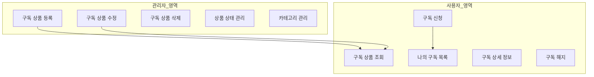
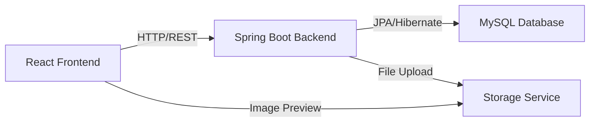
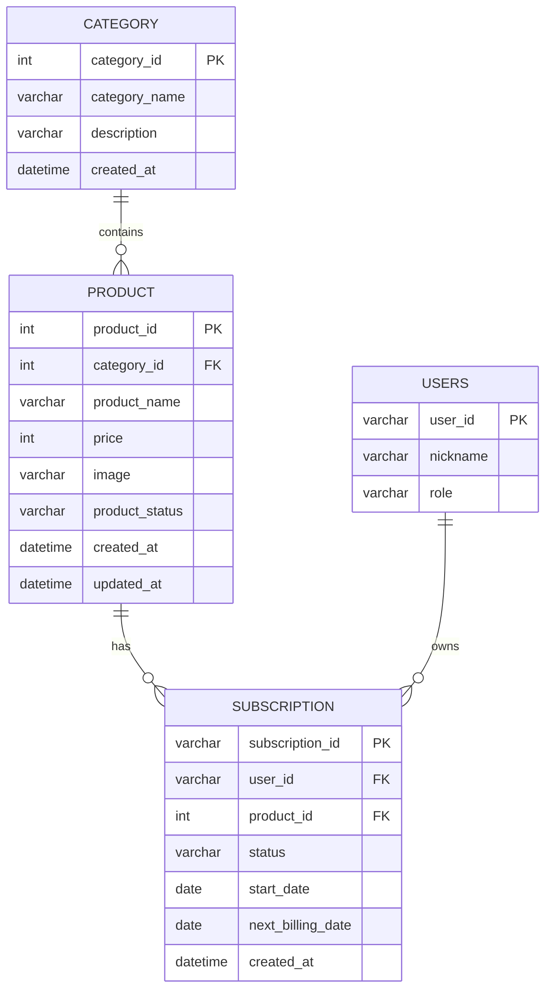

# 구독 관리 시스템 구축 가이드

> **문서 목적**: 웹 애플리케이션에서 구독 상품 관리 및 사용자 구독 목록 기능을 구현하기 위한 종합 가이드  
> **작성일**: 2025-12-02  
> **기반 프로젝트**: MoA (Subscription Sharing Platform)  
> **기술 스택**: React + TypeScript + Spring Boot

---

## 📋 목차

1. [시스템 개요](#1-시스템-개요)
2. [아키텍처 설계](#2-아키텍처-설계)
3. [데이터베이스 설계](#3-데이터베이스-설계)
4. [백엔드 API 설계](#4-백엔드-api-설계)
5. [프론트엔드 구현](#5-프론트엔드-구현)
6. [주요 기능 상세](#6-주요-기능-상세)
7. [보안 및 권한 관리](#7-보안-및-권한-관리)
8. [UI/UX 패턴](#8-uiux-패턴)
9. [테스트 전략](#9-테스트-전략)
10. [배포 및 운영](#10-배포-및-운영)

---

## 1. 시스템 개요

### 1.1 기능 범위

구독 관리 시스템은 크게 **2개의 주요 영역**으로 구성됩니다:



### 1.2 핵심 요구사항

| 구분 | 요구사항 |
|------|----------|
| **관리자** | 구독 상품 CRUD, 카테고리 관리, 상태 관리 (ACTIVE/INACTIVE) |
| **사용자** | 상품 조회, 구독 신청, 구독 목록 조회, 구독 해지 |
| **보안** | RBAC (Role-Based Access Control), 권한 검증 |
| **UX** | 직관적인 UI, 실시간 피드백, 에러 처리 |

---

## 2. 아키텍처 설계

### 2.1 시스템 아키텍처



### 2.2 레이어 구조

#### Frontend (React)

```
src/
├── pages/                          # 페이지 컴포넌트
│   ├── SubscriptionProductCreatePage.tsx   # 상품 등록/수정
│   ├── SubscriptionProductDetail.tsx       # 상품 상세
│   ├── GetProductList.tsx                  # 상품 목록
│   ├── UserSubscriptionList.tsx            # 사용자 구독 목록
│   └── UserSubscriptionDetail.tsx          # 구독 상세
├── services/                       # API 서비스 레이어
│   └── productService.ts          # 상품 관련 API
├── contexts/                       # 상태 관리
│   └── AuthContext.tsx            # 인증 컨텍스트
└── types.ts                        # TypeScript 타입 정의
```

#### Backend (Spring Boot)

```
src/main/java/
├── controller/
│   ├── ProductController.java     # 상품 API
│   ├── SubscriptionController.java # 구독 API
│   └── CategoryController.java    # 카테고리 API
├── service/
│   ├── ProductService.java
│   ├── SubscriptionService.java
│   └── FileUploadService.java
├── repository/
│   ├── ProductRepository.java
│   ├── SubscriptionRepository.java
│   └── CategoryRepository.java
└── entity/
    ├── Product.java
    ├── Subscription.java
    └── Category.java
```

---

## 3. 데이터베이스 설계

### 3.1 ERD



### 3.2 테이블 스키마

#### CATEGORY (카테고리)

```sql
CREATE TABLE CATEGORY (
    CATEGORY_ID INT AUTO_INCREMENT PRIMARY KEY,
    CATEGORY_NAME VARCHAR(50) NOT NULL UNIQUE,
    DESCRIPTION VARCHAR(255),
    CREATED_AT DATETIME DEFAULT CURRENT_TIMESTAMP,
    INDEX idx_category_name (CATEGORY_NAME)
) ENGINE=InnoDB DEFAULT CHARSET=utf8mb4;
```

#### PRODUCT (구독 상품)

```sql
CREATE TABLE PRODUCT (
    PRODUCT_ID INT AUTO_INCREMENT PRIMARY KEY,
    CATEGORY_ID INT NOT NULL,
    PRODUCT_NAME VARCHAR(100) NOT NULL,
    PRICE INT NOT NULL,
    IMAGE VARCHAR(500),
    PRODUCT_STATUS VARCHAR(20) DEFAULT 'ACTIVE',
    CREATED_AT DATETIME DEFAULT CURRENT_TIMESTAMP,
    UPDATED_AT DATETIME DEFAULT CURRENT_TIMESTAMP ON UPDATE CURRENT_TIMESTAMP,
    
    FOREIGN KEY (CATEGORY_ID) REFERENCES CATEGORY(CATEGORY_ID),
    INDEX idx_category (CATEGORY_ID),
    INDEX idx_status (PRODUCT_STATUS),
    INDEX idx_name (PRODUCT_NAME)
) ENGINE=InnoDB DEFAULT CHARSET=utf8mb4;
```

#### SUBSCRIPTION (사용자 구독)

```sql
CREATE TABLE SUBSCRIPTION (
    SUBSCRIPTION_ID VARCHAR(50) PRIMARY KEY,
    USER_ID VARCHAR(50) NOT NULL,
    PRODUCT_ID INT NOT NULL,
    STATUS VARCHAR(20) DEFAULT 'ACTIVE',
    START_DATE DATE NOT NULL,
    NEXT_BILLING_DATE DATE NOT NULL,
    CREATED_AT DATETIME DEFAULT CURRENT_TIMESTAMP,
    
    FOREIGN KEY (USER_ID) REFERENCES USERS(USER_ID),
    FOREIGN KEY (PRODUCT_ID) REFERENCES PRODUCT(PRODUCT_ID),
    INDEX idx_user (USER_ID),
    INDEX idx_product (PRODUCT_ID),
    INDEX idx_status (STATUS)
) ENGINE=InnoDB DEFAULT CHARSET=utf8mb4;
```

### 3.3 초기 데이터 (Seed Data)

```sql
-- 카테고리 초기 데이터
INSERT INTO CATEGORY (CATEGORY_NAME, DESCRIPTION) VALUES
('Video', '동영상 스트리밍 서비스'),
('Music', '음악 스트리밍 서비스'),
('Productivity', '생산성 도구'),
('Education', '교육 플랫폼');

-- 샘플 상품 데이터
INSERT INTO PRODUCT (CATEGORY_ID, PRODUCT_NAME, PRICE, IMAGE, PRODUCT_STATUS) VALUES
(1, 'Netflix Premium', 17000, 'https://example.com/netflix.png', 'ACTIVE'),
(1, 'Disney+ Premium', 13900, 'https://example.com/disney.png', 'ACTIVE'),
(2, 'Spotify Premium', 10900, 'https://example.com/spotify.png', 'ACTIVE');
```

---

## 4. 백엔드 API 설계

### 4.1 API 엔드포인트 목록

#### 상품 관리 API

| Method | Endpoint | 설명 | 권한 |
|--------|----------|------|------|
| GET | `/api/products` | 상품 목록 조회 (필터링, 페이징) | ALL |
| GET | `/api/products/{id}` | 상품 상세 조회 | ALL |
| POST | `/api/products` | 상품 등록 | ADMIN |
| PUT | `/api/products/{id}` | 상품 수정 | ADMIN |
| DELETE | `/api/products/{id}` | 상품 삭제 | ADMIN |
| POST | `/api/products/upload` | 이미지 업로드 | ADMIN |

#### 카테고리 API

| Method | Endpoint | 설명 | 권한 |
|--------|----------|------|------|
| GET | `/api/categories` | 카테고리 목록 조회 | ALL |

#### 구독 API

| Method | Endpoint | 설명 | 권한 |
|--------|----------|------|------|
| GET | `/api/subscriptions/my` | 나의 구독 목록 | USER |
| GET | `/api/subscriptions/{id}` | 구독 상세 조회 | USER |
| POST | `/api/subscriptions` | 구독 신청 | USER |
| DELETE | `/api/subscriptions/{id}` | 구독 해지 | USER |

### 4.2 API 상세 스펙

#### 4.2.1 상품 목록 조회

**Request**
```http
GET /api/products?category=Video&status=ACTIVE&page=0&size=10
```

**Response**
```json
{
  "content": [
    {
      "productId": 1,
      "categoryId": 1,
      "categoryName": "Video",
      "productName": "Netflix Premium",
      "price": 17000,
      "image": "https://example.com/netflix.png",
      "productStatus": "ACTIVE",
      "createdAt": "2025-12-01T10:00:00",
      "updatedAt": "2025-12-01T10:00:00"
    }
  ],
  "totalElements": 5,
  "totalPages": 1,
  "size": 10,
  "number": 0
}
```

#### 4.2.2 상품 등록

**Request**
```http
POST /api/products
Content-Type: application/json
Authorization: Bearer {token}

{
  "categoryId": 1,
  "productName": "Netflix Premium",
  "price": 17000,
  "image": "https://example.com/netflix.png",
  "productStatus": "ACTIVE"
}
```

**Response**
```json
{
  "productId": 1,
  "categoryId": 1,
  "productName": "Netflix Premium",
  "price": 17000,
  "image": "https://example.com/netflix.png",
  "productStatus": "ACTIVE",
  "createdAt": "2025-12-01T10:00:00"
}
```

#### 4.2.3 이미지 업로드

**Request**
```http
POST /api/products/upload
Content-Type: multipart/form-data
Authorization: Bearer {token}

file: [binary data]
```

**Response**
```json
{
  "imageUrl": "https://storage.example.com/uploads/abc123.png"
}
```

#### 4.2.4 나의 구독 목록 조회

**Request**
```http
GET /api/subscriptions/my
Authorization: Bearer {token}
```

**Response**
```json
[
  {
    "id": "SUB-001",
    "userId": "user123",
    "product": {
      "productId": 1,
      "productName": "Netflix Premium",
      "categoryName": "Video",
      "price": 17000,
      "iconUrl": "https://example.com/netflix.png"
    },
    "status": "ACTIVE",
    "startDate": "2025-11-01",
    "nextBillingDate": "2025-12-01"
  }
]
```

### 4.3 Spring Boot Controller 예시

#### ProductController.java

```java
@RestController
@RequestMapping("/api/products")
@RequiredArgsConstructor
public class ProductController {
    
    private final ProductService productService;
    
    @GetMapping
    public ResponseEntity<Page<ProductDTO>> getProducts(
        @RequestParam(required = false) String category,
        @RequestParam(required = false) String status,
        @PageableDefault(size = 10) Pageable pageable
    ) {
        Page<ProductDTO> products = productService.getProducts(category, status, pageable);
        return ResponseEntity.ok(products);
    }
    
    @GetMapping("/{id}")
    public ResponseEntity<ProductDTO> getProduct(@PathVariable Integer id) {
        ProductDTO product = productService.getProduct(id);
        return ResponseEntity.ok(product);
    }
    
    @PostMapping
    @PreAuthorize("hasRole('ADMIN')")
    public ResponseEntity<ProductDTO> createProduct(@Valid @RequestBody ProductCreateRequest request) {
        ProductDTO product = productService.createProduct(request);
        return ResponseEntity.status(HttpStatus.CREATED).body(product);
    }
    
    @PutMapping("/{id}")
    @PreAuthorize("hasRole('ADMIN')")
    public ResponseEntity<ProductDTO> updateProduct(
        @PathVariable Integer id,
        @Valid @RequestBody ProductUpdateRequest request
    ) {
        ProductDTO product = productService.updateProduct(id, request);
        return ResponseEntity.ok(product);
    }
    
    @DeleteMapping("/{id}")
    @PreAuthorize("hasRole('ADMIN')")
    public ResponseEntity<Void> deleteProduct(@PathVariable Integer id) {
        productService.deleteProduct(id);
        return ResponseEntity.noContent().build();
    }
    
    @PostMapping("/upload")
    @PreAuthorize("hasRole('ADMIN')")
    public ResponseEntity<ImageUploadResponse> uploadImage(@RequestParam("file") MultipartFile file) {
        String imageUrl = productService.uploadImage(file);
        return ResponseEntity.ok(new ImageUploadResponse(imageUrl));
    }
}
```

---

## 5. 프론트엔드 구현

### 5.1 TypeScript 타입 정의

#### types.ts

```typescript
// 카테고리
export interface Category {
  categoryId: number;
  categoryName: string;
  description?: string;
}

// 상품
export interface Product {
  productId: number;
  categoryId: number;
  categoryName?: string;
  productName: string;
  price: number;
  image: string;
  productStatus: 'ACTIVE' | 'INACTIVE';
  createdAt?: string;
  updatedAt?: string;
}

// 구독
export interface Subscription {
  id: string;
  userId: string;
  product: {
    productId: number;
    productName: string;
    categoryName: string;
    price: number;
    iconUrl: string;
    tier?: string;
    description?: string;
  };
  status: 'ACTIVE' | 'CANCELLED';
  startDate: string;
  nextBillingDate: string;
}

// API 요청/응답
export interface ProductCreateRequest {
  categoryId: number;
  productName: string;
  price: number;
  image: string;
  productStatus: 'ACTIVE' | 'INACTIVE';
}

export interface ProductUpdateRequest extends ProductCreateRequest {
  productId: number;
}

export interface PageResponse<T> {
  content: T[];
  totalElements: number;
  totalPages: number;
  size: number;
  number: number;
}
```

### 5.2 API 서비스 레이어

#### productService.ts

```typescript
import axios from 'axios';
import { Product, Category, ProductCreateRequest, ProductUpdateRequest, PageResponse } from '../types';

const API_BASE_URL = '/api';

export const productService = {
  // 상품 목록 조회
  async getProducts(
    category?: string,
    status?: string,
    page: number = 0,
    size: number = 10
  ): Promise<PageResponse<Product>> {
    const params = new URLSearchParams();
    if (category) params.append('category', category);
    if (status) params.append('status', status);
    params.append('page', page.toString());
    params.append('size', size.toString());
    
    const response = await axios.get(`${API_BASE_URL}/products?${params}`);
    return response.data;
  },

  // 상품 상세 조회
  async getProduct(id: number): Promise<Product> {
    const response = await axios.get(`${API_BASE_URL}/products/${id}`);
    return response.data;
  },

  // 상품 등록
  async addProduct(data: ProductCreateRequest): Promise<Product> {
    const response = await axios.post(`${API_BASE_URL}/products`, data);
    return response.data;
  },

  // 상품 수정
  async updateProduct(data: ProductUpdateRequest): Promise<Product> {
    const response = await axios.put(`${API_BASE_URL}/products/${data.productId}`, data);
    return response.data;
  },

  // 상품 삭제
  async deleteProduct(id: number): Promise<void> {
    await axios.delete(`${API_BASE_URL}/products/${id}`);
  },

  // 이미지 업로드
  async uploadImage(file: File): Promise<string> {
    const formData = new FormData();
    formData.append('file', file);
    
    const response = await axios.post(`${API_BASE_URL}/products/upload`, formData, {
      headers: { 'Content-Type': 'multipart/form-data' }
    });
    return response.data.imageUrl;
  },

  // 카테고리 목록 조회
  async getCategories(): Promise<Category[]> {
    const response = await axios.get(`${API_BASE_URL}/categories`);
    return response.data;
  }
};
```

---

## 6. 주요 기능 상세

### 6.1 관리자: 구독 상품 등록/수정

#### 6.1.1 페이지 구조

**SubscriptionProductCreatePage.tsx**

```typescript
import React, { useState, useEffect } from 'react';
import { useNavigate, useParams } from 'react-router-dom';
import { useAuth } from '../contexts/AuthContext';
import { productService, Category } from '../services/productService';

const SubscriptionProductCreatePage = () => {
  const navigate = useNavigate();
  const { id } = useParams();
  const { user } = useAuth();
  const isEditMode = !!id;

  // Form State
  const [productName, setProductName] = useState('');
  const [categoryId, setCategoryId] = useState<number>(0);
  const [price, setPrice] = useState('');
  const [image, setImage] = useState('');
  const [productStatus, setProductStatus] = useState('ACTIVE');

  // Data State
  const [categories, setCategories] = useState<Category[]>([]);
  const [loading, setLoading] = useState(false);

  // 권한 검증
  if (user?.role !== 'ADMIN') {
    return (
      <div className="p-8 text-center">
        <h2 className="text-xl font-bold text-red-600">접근 권한이 없습니다.</h2>
        <button onClick={() => navigate('/')} className="mt-4 px-4 py-2 bg-slate-900 text-white rounded-lg">
          홈으로 돌아가기
        </button>
      </div>
    );
  }

  // 데이터 초기화
  useEffect(() => {
    const initData = async () => {
      try {
        setLoading(true);
        const categoriesData = await productService.getCategories();
        setCategories(categoriesData);

        if (!isEditMode && categoriesData.length > 0) {
          setCategoryId(categoriesData[0].categoryId);
        }

        if (isEditMode && id) {
          const productData = await productService.getProduct(parseInt(id));
          setProductName(productData.productName);
          setCategoryId(productData.categoryId);
          setPrice(productData.price.toString());
          setImage(productData.image);
          setProductStatus(productData.productStatus);
        }
      } catch (error) {
        console.error("Failed to load data", error);
        alert("데이터를 불러오는데 실패했습니다.");
        navigate('/subscriptions');
      } finally {
        setLoading(false);
      }
    };

    initData();
  }, [isEditMode, id, navigate]);

  // 폼 제출
  const handleSubmit = async (e: React.FormEvent) => {
    e.preventDefault();

    if (!productName || !price || !categoryId) {
      alert('필수 항목을 모두 입력해주세요.');
      return;
    }

    try {
      const productData = {
        categoryId,
        productName,
        productStatus,
        price: Number(price),
        image
      };

      if (isEditMode && id) {
        await productService.updateProduct({
          ...productData,
          productId: parseInt(id)
        });
        alert('상품이 성공적으로 수정되었습니다!');
      } else {
        await productService.addProduct(productData);
        alert('상품이 성공적으로 등록되었습니다!');
      }

      navigate('/subscriptions');
    } catch (error) {
      console.error("Failed to save product", error);
      alert("상품 저장에 실패했습니다.");
    }
  };

  // 이미지 업로드 핸들러
  const handleImageUpload = async (e: React.ChangeEvent<HTMLInputElement>) => {
    const file = e.target.files?.[0];
    if (file) {
      try {
        const imageUrl = await productService.uploadImage(file);
        setImage(imageUrl);
      } catch (error) {
        console.error("Image upload failed", error);
        alert("이미지 업로드에 실패했습니다.");
      }
    }
  };

  if (loading) {
    return <div className="text-center py-20">로딩 중...</div>;
  }

  return (
    <div className="max-w-2xl mx-auto px-4 py-8">
      {/* 폼 UI는 생략 - 위의 전체 코드 참조 */}
    </div>
  );
};

export default SubscriptionProductCreatePage;
```

#### 6.1.2 핵심 구현 포인트

> [!IMPORTANT]
> **필수 구현 사항**

1. **권한 검증**: `user.role === 'ADMIN'` 체크
2. **모드 전환**: URL 파라미터로 등록/수정 모드 자동 전환
3. **카테고리 동적 로딩**: API에서 카테고리 목록 가져오기
4. **이미지 업로드**: 파일 선택 → 서버 업로드 → URL 저장
5. **폼 유효성 검사**: 필수 필드 체크
6. **에러 처리**: try-catch로 API 에러 핸들링

### 6.2 사용자: 나의 구독 목록

#### 6.2.1 페이지 구조

**UserSubscriptionList.tsx**

```typescript
import React from 'react';
import { Link, useNavigate } from 'react-router-dom';
import { Calendar, ChevronRight, CreditCard, AlertCircle } from 'lucide-react';
import { useAuth } from '../contexts/AuthContext';

const UserSubscriptionList = () => {
  const { user } = useAuth();
  const navigate = useNavigate();

  // 실제 앱에서는 API로 구독 목록 가져오기
  const [subscriptions, setSubscriptions] = useState([]);
  const [loading, setLoading] = useState(true);

  useEffect(() => {
    const fetchSubscriptions = async () => {
      try {
        const response = await axios.get('/api/subscriptions/my');
        setSubscriptions(response.data);
      } catch (error) {
        console.error('Failed to fetch subscriptions', error);
      } finally {
        setLoading(false);
      }
    };

    if (user) {
      fetchSubscriptions();
    }
  }, [user]);

  if (!user) {
    return <div className="p-8 text-center">로그인이 필요합니다.</div>;
  }

  if (loading) {
    return <div className="text-center py-20">로딩 중...</div>;
  }

  return (
    <div className="max-w-3xl mx-auto px-4 py-8">
      <h1 className="text-3xl font-extrabold text-slate-900 mb-2">내 구독 목록 💳</h1>
      <p className="text-slate-500 mb-8">이용 중인 구독 서비스를 관리하세요.</p>

      {subscriptions.length === 0 ? (
        <div className="text-center py-20 bg-white rounded-3xl border border-slate-200">
          <div className="w-16 h-16 bg-slate-100 rounded-full flex items-center justify-center mx-auto mb-4">
            <AlertCircle className="w-8 h-8 text-slate-400" />
          </div>
          <h3 className="text-lg font-bold text-slate-900 mb-2">구독 중인 상품이 없습니다.</h3>
          <p className="text-slate-500 mb-6">새로운 구독을 시작해보세요!</p>
          <Link to="/subscriptions" className="px-6 py-3 bg-brand-600 text-white font-bold rounded-xl hover:bg-brand-700 transition-colors">
            구독 상품 보러가기
          </Link>
        </div>
      ) : (
        <div className="space-y-4">
          {subscriptions.map((sub) => (
            <div
              key={sub.id}
              onClick={() => navigate(`/my/subscriptions/${sub.id}`)}
              className="bg-white rounded-2xl border border-slate-200 p-6 hover:shadow-lg hover:-translate-y-1 transition-all cursor-pointer group"
            >
              <div className="flex items-center justify-between">
                <div className="flex items-center gap-4">
                  
                  <div>
                    <div className="flex items-center gap-2 mb-1">
                      <h3 className="font-bold text-slate-900 text-lg">{sub.product.name}</h3>
                      <span className={`px-2 py-0.5 text-[10px] font-bold rounded-md
                        ${sub.status === 'ACTIVE' ? 'bg-green-100 text-green-700' : 'bg-red-100 text-red-700'}
                      `}>
                        {sub.status === 'ACTIVE' ? '이용중' : '해지됨'}
                      </span>
                    </div>
                    <p className="text-sm text-slate-500">{sub.product.tier}</p>
                  </div>
                </div>
                <ChevronRight className="w-5 h-5 text-slate-400 group-hover:text-brand-600 transition-colors" />
              </div>

              <div className="mt-6 pt-4 border-t border-slate-100 flex items-center justify-between text-sm">
                <div className="flex items-center gap-2 text-slate-500">
                  <Calendar className="w-4 h-4" />
                  <span>다음 결제일: <span className="font-semibold text-slate-700">{sub.nextBillingDate}</span></span>
                </div>
                <div className="flex items-center gap-2 text-slate-500">
                  <CreditCard className="w-4 h-4" />
                  <span>월 <span className="font-bold text-slate-900">₩{sub.product.price.toLocaleString()}</span></span>
                </div>
              </div>
            </div>
          ))}
        </div>
      )}
    </div>
  );
};

export default UserSubscriptionList;
```

#### 6.2.2 핵심 구현 포인트

> [!TIP]
> **UX 개선 포인트**

1. **빈 상태 처리**: 구독이 없을 때 안내 메시지 + CTA 버튼
2. **카드 UI**: 호버 효과로 클릭 가능함을 시각적으로 표현
3. **상태 뱃지**: 이용중/해지됨 상태를 색상으로 구분
4. **정보 표시**: 다음 결제일, 월 분담금 등 핵심 정보 강조
5. **로딩 상태**: 데이터 로딩 중 스피너 표시

---

## 7. 보안 및 권한 관리

### 7.1 RBAC (Role-Based Access Control)

#### 7.1.1 역할 정의

```typescript
export enum UserRole {
  ADMIN = 'ADMIN',
  USER = 'USER'
}

export interface User {
  id: string;
  nickname: string;
  role: UserRole;
}
```

#### 7.1.2 프론트엔드 권한 검증

```typescript
// AuthContext.tsx
export const useAuth = () => {
  const context = useContext(AuthContext);
  if (!context) {
    throw new Error('useAuth must be used within AuthProvider');
  }
  return context;
};

// 페이지 컴포넌트에서 사용
const { user } = useAuth();

if (user?.role !== 'ADMIN') {
  return <div>접근 권한이 없습니다.</div>;
}
```

#### 7.1.3 백엔드 권한 검증

```java
// Spring Security 설정
@Configuration
@EnableWebSecurity
public class SecurityConfig {
    
    @Bean
    public SecurityFilterChain filterChain(HttpSecurity http) throws Exception {
        http
            .authorizeHttpRequests(auth -> auth
                .requestMatchers("/api/products").permitAll()
                .requestMatchers("/api/products/**").hasRole("ADMIN")
                .requestMatchers("/api/subscriptions/my").hasRole("USER")
                .anyRequest().authenticated()
            );
        return http.build();
    }
}

// Controller에서 추가 검증
@PreAuthorize("hasRole('ADMIN')")
@PostMapping("/api/products")
public ResponseEntity<ProductDTO> createProduct(@RequestBody ProductCreateRequest request) {
    // ...
}
```

### 7.2 데이터 보안

> [!CAUTION]
> **보안 체크리스트**

- [ ] **SQL Injection 방지**: JPA/Hibernate 사용, PreparedStatement
- [ ] **XSS 방지**: 사용자 입력 sanitize, React는 기본적으로 XSS 방지
- [ ] **CSRF 방지**: CSRF 토큰 사용
- [ ] **파일 업로드 검증**: 파일 타입, 크기 제한
- [ ] **이미지 URL 검증**: 허용된 도메인만 사용
- [ ] **API Rate Limiting**: 과도한 요청 방지

---

## 8. UI/UX 패턴

### 8.1 디자인 시스템

#### 8.1.1 컬러 팔레트

```css
/* 브랜드 컬러 */
--brand-50: #eef2ff;
--brand-500: #6366f1;
--brand-600: #4f46e5;
--brand-700: #4338ca;

/* 상태 컬러 */
--success: #10b981;  /* 활성 */
--error: #ef4444;    /* 비활성/에러 */
--warning: #f59e0b;  /* 경고 */
```

#### 8.1.2 타이포그래피

```css
/* 제목 */
.heading-1 { font-size: 2rem; font-weight: 800; }
.heading-2 { font-size: 1.5rem; font-weight: 700; }

/* 본문 */
.body-text { font-size: 1rem; font-weight: 400; }
.body-small { font-size: 0.875rem; font-weight: 400; }
```

### 8.2 컴포넌트 패턴

#### 8.2.1 카드 컴포넌트

```typescript
// 재사용 가능한 카드 컴포넌트
const Card: React.FC<{ children: React.ReactNode; onClick?: () => void }> = ({ children, onClick }) => {
  return (
    <div 
      onClick={onClick}
      className="bg-white rounded-2xl border border-slate-200 p-6 hover:shadow-lg hover:-translate-y-1 transition-all cursor-pointer"
    >
      {children}
    </div>
  );
};
```

#### 8.2.2 상태 뱃지

```typescript
const StatusBadge: React.FC<{ status: 'ACTIVE' | 'INACTIVE' | 'CANCELLED' }> = ({ status }) => {
  const styles = {
    ACTIVE: 'bg-green-100 text-green-700',
    INACTIVE: 'bg-slate-100 text-slate-500',
    CANCELLED: 'bg-red-100 text-red-700'
  };

  const labels = {
    ACTIVE: '활성',
    INACTIVE: '비활성',
    CANCELLED: '해지됨'
  };

  return (
    <span className={`px-3 py-1 text-sm font-bold rounded-full ${styles[status]}`}>
      {labels[status]}
    </span>
  );
};
```

### 8.3 반응형 디자인

```css
/* Mobile First */
.container {
  padding: 1rem;
}

/* Tablet (768px~) */
@media (min-width: 768px) {
  .container {
    padding: 2rem;
  }
}

/* Desktop (1024px~) */
@media (min-width: 1024px) {
  .container {
    max-width: 1200px;
    margin: 0 auto;
  }
}
```

---

## 9. 테스트 전략

### 9.1 단위 테스트 (Unit Test)

#### 9.1.1 Service 테스트

```typescript
// productService.test.ts
import { productService } from './productService';
import axios from 'axios';

jest.mock('axios');
const mockedAxios = axios as jest.Mocked<typeof axios>;

describe('productService', () => {
  describe('getProducts', () => {
    it('should fetch products successfully', async () => {
      const mockData = {
        content: [{ productId: 1, productName: 'Netflix' }],
        totalElements: 1
      };
      
      mockedAxios.get.mockResolvedValue({ data: mockData });
      
      const result = await productService.getProducts();
      
      expect(result).toEqual(mockData);
      expect(mockedAxios.get).toHaveBeenCalledWith('/api/products?page=0&size=10');
    });
  });
});
```

#### 9.1.2 Component 테스트

```typescript
// UserSubscriptionList.test.tsx
import { render, screen } from '@testing-library/react';
import UserSubscriptionList from './UserSubscriptionList';

describe('UserSubscriptionList', () => {
  it('should show empty state when no subscriptions', () => {
    render(<UserSubscriptionList />);
    
    expect(screen.getByText('구독 중인 상품이 없습니다.')).toBeInTheDocument();
  });
});
```

### 9.2 통합 테스트 (Integration Test)

```java
// ProductControllerTest.java
@SpringBootTest
@AutoConfigureMockMvc
class ProductControllerTest {
    
    @Autowired
    private MockMvc mockMvc;
    
    @Test
    @WithMockUser(roles = "ADMIN")
    void createProduct_shouldReturnCreated() throws Exception {
        String requestBody = """
            {
                "categoryId": 1,
                "productName": "Netflix",
                "price": 17000,
                "productStatus": "ACTIVE"
            }
            """;
        
        mockMvc.perform(post("/api/products")
                .contentType(MediaType.APPLICATION_JSON)
                .content(requestBody))
            .andExpect(status().isCreated())
            .andExpect(jsonPath("$.productName").value("Netflix"));
    }
}
```

### 9.3 E2E 테스트 (Playwright)

```typescript
// subscription.spec.ts
import { test, expect } from '@playwright/test';

test('admin can create product', async ({ page }) => {
  await page.goto('/login');
  await page.fill('input[name="username"]', 'admin');
  await page.fill('input[name="password"]', 'password');
  await page.click('button[type="submit"]');
  
  await page.goto('/subscriptions/create');
  await page.fill('input[name="productName"]', 'Netflix Premium');
  await page.selectOption('select[name="categoryId"]', '1');
  await page.fill('input[name="price"]', '17000');
  await page.click('button[type="submit"]');
  
  await expect(page).toHaveURL('/subscriptions');
  await expect(page.locator('text=Netflix Premium')).toBeVisible();
});
```

---

## 10. 배포 및 운영

### 10.1 환경 설정

#### 10.1.1 환경 변수 (.env)

```bash
# Frontend (.env.local)
VITE_API_BASE_URL=http://localhost:8080
VITE_UPLOAD_MAX_SIZE=5242880  # 5MB

# Backend (application.yml)
spring:
  datasource:
    url: jdbc:mysql://localhost:3306/moa_db
    username: ${DB_USERNAME}
    password: ${DB_PASSWORD}
  
  servlet:
    multipart:
      max-file-size: 5MB
      max-request-size: 10MB

file:
  upload:
    dir: /var/uploads
```

### 10.2 빌드 및 배포

#### 10.2.1 Frontend 빌드

```bash
# 프로덕션 빌드
npm run build

# 빌드 결과물
dist/
├── index.html
├── assets/
│   ├── index-abc123.js
│   └── index-def456.css
```

#### 10.2.2 Backend 빌드

```bash
# Maven 빌드
mvn clean package

# JAR 파일 실행
java -jar target/moa-backend-1.0.0.jar
```

### 10.3 Nginx 설정

```nginx
server {
    listen 80;
    server_name moamoa.cloud;

    # Frontend (React SPA)
    location / {
        root /var/www/frontend/dist;
        try_files $uri $uri/ /index.html;
    }

    # Backend API
    location /api {
        proxy_pass http://localhost:8080;
        proxy_set_header Host $host;
        proxy_set_header X-Real-IP $remote_addr;
    }

    # 업로드된 파일
    location /uploads {
        alias /var/uploads;
        expires 30d;
    }
}
```

### 10.4 모니터링

#### 10.4.1 로그 수집

```java
// Logback 설정 (logback-spring.xml)
<configuration>
    <appender name="FILE" class="ch.qos.logback.core.rolling.RollingFileAppender">
        <file>/var/log/moa/application.log</file>
        <rollingPolicy class="ch.qos.logback.core.rolling.TimeBasedRollingPolicy">
            <fileNamePattern>/var/log/moa/application-%d{yyyy-MM-dd}.log</fileNamePattern>
            <maxHistory>30</maxHistory>
        </rollingPolicy>
    </appender>
    
    <logger name="com.moa" level="INFO"/>
    <root level="WARN">
        <appender-ref ref="FILE"/>
    </root>
</configuration>
```

#### 10.4.2 성능 모니터링

```java
// Spring Actuator
@Configuration
public class ActuatorConfig {
    @Bean
    public HealthIndicator customHealthIndicator() {
        return () -> Health.up()
            .withDetail("database", "MySQL")
            .withDetail("status", "operational")
            .build();
    }
}
```

---

## 📊 체크리스트

### 개발 단계

- [ ] 데이터베이스 스키마 생성
- [ ] 백엔드 API 구현
- [ ] 프론트엔드 페이지 구현
- [ ] RBAC 권한 검증
- [ ] 이미지 업로드 기능
- [ ] 에러 처리
- [ ] 로딩 상태 처리

### 테스트 단계

- [ ] 단위 테스트 작성
- [ ] 통합 테스트 작성
- [ ] E2E 테스트 작성
- [ ] 보안 테스트
- [ ] 성능 테스트

### 배포 단계

- [ ] 환경 변수 설정
- [ ] 빌드 스크립트 작성
- [ ] Nginx 설정
- [ ] SSL 인증서 설정
- [ ] 모니터링 설정
- [ ] 백업 전략 수립

---

## 🔗 참고 자료

- [React 공식 문서](https://react.dev/)
- [Spring Boot 공식 문서](https://spring.io/projects/spring-boot)
- [TypeScript 공식 문서](https://www.typescriptlang.org/)
- [Tailwind CSS 공식 문서](https://tailwindcss.com/)

---

## 📝 결론

이 가이드는 **구독 관리 시스템**을 처음부터 구축하기 위한 종합 가이드입니다.

### 핵심 포인트

✅ **명확한 역할 분리**: 관리자(상품 관리) vs 사용자(구독 관리)  
✅ **RBAC 적용**: 권한 기반 접근 제어  
✅ **RESTful API**: 표준 HTTP 메서드 사용  
✅ **타입 안정성**: TypeScript로 타입 정의  
✅ **사용자 경험**: 로딩, 에러, 빈 상태 처리  
✅ **보안**: 입력 검증, 파일 업로드 제한, SQL Injection 방지  

이 가이드를 기반으로 다른 웹 애플리케이션에서도 구독 관리 시스템을 쉽게 구현할 수 있습니다.
