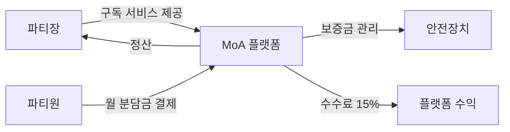
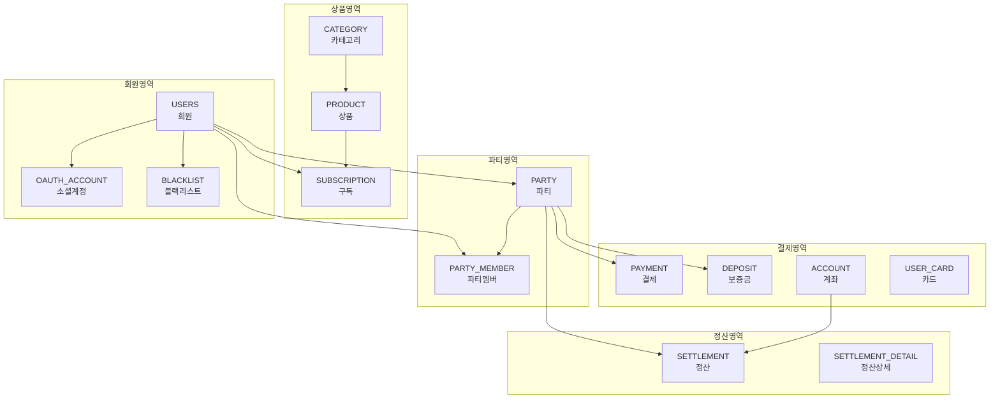

# MoA 프로젝트 종합 분석 보고서

> **분석일**: 2025-12-02  
> **프로젝트명**: MoA (Subscription Sharing Platform)  
> **프로젝트 경로**: `c:\kjw_workspace_git\joeun_SpringBoot_kjw\zz.files\src\frontend`

---

## 📋 목차

1. [프로젝트 개요](#1-프로젝트-개요)
2. [기술 스택](#2-기술-스택)
3. [프로젝트 구조](#3-프로젝트-구조)
4. [데이터베이스 설계](#4-데이터베이스-설계)
5. [주요 기능](#5-주요-기능)
6. [컴포넌트 분석](#6-컴포넌트-분석)
7. [페이지 구성](#7-페이지-구성)
8. [서비스 레이어](#8-서비스-레이어)
9. [디자인 시스템](#9-디자인-시스템)
10. [배포 및 설정](#10-배포-및-설정)
11. [개선 제안](#11-개선-제안)

---

## 1. 프로젝트 개요

### 1.1 프로젝트 목표

**MoA**는 2030 세대를 타겟으로 한 구독 서비스(OTT 등) 공유 중개 플랫폼입니다.

- **핵심 컨셉**: "혼자 내면 부담, 같이 내면 반값"
- **주요 가치**: 합리적인 소비, 안전한 공유, 즉시 매칭
- **타겟 사용자**: 트렌드에 민감하고 합리적인 소비를 추구하는 2030 세대

### 1.2 비즈니스 모델



- **파티장**: 구독 서비스를 보유하고 파티를 생성
- **파티원**: 파티에 참여하여 월 분담금 지불
- **플랫폼**: 중개 역할, 보증금 관리, 자동 정산 (수수료 15%)

---

## 2. 기술 스택

### 2.1 Frontend

| 기술 | 버전 | 용도 |
|------|------|------|
| **React** | 19.2.0 | UI 프레임워크 |
| **TypeScript** | 5.8.2 | 타입 안정성 |
| **React Router DOM** | 7.9.6 | 클라이언트 사이드 라우팅 |
| **Vite** | 6.2.0 | 빌드 도구 |
| **Tailwind CSS** | CDN | 스타일링 |
| **D3.js** | 7.9.0 | 데이터 시각화 (절약 차트) |
| **Lucide React** | 0.554.0 | 아이콘 라이브러리 |
| **Axios** | 1.13.2 | HTTP 클라이언트 |

### 2.2 AI & External Services

| 서비스 | 용도 |
|--------|------|
| **Google Gemini API** | AI 챗봇 어시스턴트 |
| **Toss Payments** | 결제 시스템 (추정) |

### 2.3 Backend (추정)

- **Spring Boot** (프로젝트 경로에서 추정)
- **MySQL** (데이터베이스)
- **포트**: 8080 (Vite 프록시 설정 기준)

---

## 3. 프로젝트 구조

### 3.1 디렉토리 구조

```
frontend/
├── src/
│   ├── components/          # 재사용 가능한 UI 컴포넌트
│   │   ├── Footer.tsx
│   │   ├── GeminiAssistant.tsx
│   │   ├── Navbar.tsx
│   │   ├── SavingsChart.tsx
│   │   ├── ScrollToTop.tsx
│   │   └── Sidebar.tsx
│   ├── contexts/            # React Context (상태 관리)
│   │   └── AuthContext.tsx
│   ├── pages/               # 페이지 컴포넌트
│   │   ├── CreatePartyPage.tsx
│   │   ├── EditProfilePage.tsx
│   │   ├── GetProductList.tsx
│   │   ├── LoginPage.tsx
│   │   ├── SubscriptionProductCreatePage.tsx
│   │   ├── SubscriptionProductDetail.tsx
│   │   ├── SupportPage.tsx
│   │   ├── UserSubscriptionDetail.tsx
│   │   └── UserSubscriptionList.tsx
│   ├── services/            # API 서비스 레이어
│   │   ├── authService.ts
│   │   ├── geminiService.ts
│   │   └── productService.ts
│   ├── App.tsx              # 메인 애플리케이션 (라우팅)
│   ├── constants.ts         # 상수 및 Mock 데이터
│   ├── types.ts             # TypeScript 타입 정의
│   └── index.tsx            # 엔트리 포인트
├── index.html               # HTML 템플릿
├── vite.config.ts           # Vite 설정
├── package.json             # 의존성 관리
├── tsconfig.json            # TypeScript 설정
├── specification.md         # 프로젝트 명세서
├── 청사진.md                # 구현 계획
└── moamoa_mysql_*.sql       # 데이터베이스 스키마
```

### 3.2 파일 통계

- **총 파일 수**: 23개 (TypeScript/TSX)
- **컴포넌트**: 6개
- **페이지**: 9개
- **서비스**: 3개
- **Context**: 1개

---

## 4. 데이터베이스 설계

### 4.1 ERD 개요

데이터베이스는 **18개의 테이블**로 구성되어 있으며, 크게 5개 영역으로 분류됩니다.



### 4.2 주요 테이블 상세

#### 4.2.1 USERS (회원)

| 컬럼명 | 타입 | 설명 |
|--------|------|------|
| USER_ID | VARCHAR(50) | 회원 ID (PK) |
| PASSWORD | VARCHAR(50) | 비밀번호 |
| NICKNAME | VARCHAR(20) | 닉네임 |
| PHONE | VARCHAR(14) | 전화번호 |
| ROLE | VARCHAR(20) | 역할 (USER/ADMIN) |
| USER_STATUS | VARCHAR(20) | 회원 상태 |
| CI/DI | VARCHAR(100) | 본인인증 정보 (UNIQUE) |
| LOGIN_FAIL_COUNT | INT | 로그인 실패 횟수 |

> [!IMPORTANT]
> - **CI/DI**: 본인인증 고유값으로 중복 가입 방지
> - **ROLE**: 일반 사용자(USER)와 관리자(ADMIN) 구분

#### 4.2.2 PARTY (파티)

| 컬럼명 | 타입 | 설명 |
|--------|------|------|
| PARTY_ID | INT | 파티 ID (PK, AUTO_INCREMENT) |
| PARTY_LEADER_ID | VARCHAR(50) | 파티장 ID (FK → USERS) |
| PARTY_STATUS | VARCHAR(20) | 파티 상태 (RECRUITING/ACTIVE/FULL/ENDED) |
| MAX_MEMBERS | INT | 최대 인원 |
| CURRENT_MEMBERS | INT | 현재 인원 |
| MONTHLY_FEE | INT | 월 분담금 |
| OTT_ID/PASSWORD | VARCHAR | OTT 계정 정보 (암호화 필요) |

#### 4.2.3 PAYMENT (결제)

| 컬럼명 | 타입 | 설명 |
|--------|------|------|
| PAYMENT_ID | INT | 결제 ID (PK) |
| TOSS_PAYMENT_KEY | VARCHAR(255) | Toss Payments 결제 키 |
| PAYMENT_STATUS | VARCHAR(20) | 결제 상태 |
| TARGET_MONTH | VARCHAR(7) | 결제 대상 월 (YYYY-MM) |

#### 4.2.4 SETTLEMENT (정산)

| 컬럼명 | 타입 | 설명 |
|--------|------|------|
| COMMISSION_RATE | DECIMAL(3,2) | 수수료율 (기본 0.15 = 15%) |
| COMMISSION_AMOUNT | INT | 수수료 금액 |
| NET_AMOUNT | INT | 실 정산 금액 |

---

## 5. 주요 기능

### 5.1 사용자 기능

#### 5.1.1 회원 관리
- ✅ 회원가입 / 로그인
- ✅ 소셜 로그인 (OAuth 연동)
- ✅ 본인인증 (PASS 인증)
- ✅ 프로필 수정
- ✅ 로그인 실패 잠금 (5회 실패 시)

#### 5.1.2 파티 기능
- ✅ 파티 찾기 (검색 & 필터링)
  - 서비스명 검색 (Netflix, Disney+, Spotify 등)
  - 카테고리 필터 (Video, Music, Productivity)
- ✅ 파티 생성
- ✅ 파티 참여 / 탈퇴
- ✅ 파티 상태 관리 (모집중/마감/진행중/종료)

#### 5.1.3 구독 관리

**나의 구독 목록 (`UserSubscriptionList`)**
- ✅ 사용자별 구독 목록 조회
- ✅ 구독 상태 표시 (이용중/해지됨)
- ✅ 다음 결제일 표시 (D-Day)
- ✅ 월 분담금 표시
- ✅ 빈 상태 처리 (구독 없을 시 안내)
- ✅ 카드 형태 UI (호버 효과)

**구독 상세 정보 (`UserSubscriptionDetail`)**
- ✅ 구독 상세 정보 조회
  - 상품명, 카테고리, 요금제
  - 시작일, 다음 결제일
  - 결제 금액
- ✅ 구독 해지 기능
  - 확인 모달 (confirm)
  - 다음 결제일부터 중단 안내
- ✅ 요금제 변경 버튼 (UI 준비)
- ✅ 상태 뱃지 (활성/비활성)

#### 5.1.4 결제 & 정산
- ✅ 보증금 결제
- ✅ 월 분담금 자동 결제
- ✅ 카드 등록 (빌링키 방식)
- ✅ 계좌 등록 (정산용)
- ✅ 정산 내역 조회

#### 5.1.5 마이페이지
- ✅ 개인화 대시보드
  - 총 절약 금액 (누적)
  - 다음 결제일 D-Day
  - 참여 중인 파티 수
- ✅ 절약 차트 (D3.js)
  - 일반 구독 vs MoA 이용 시 절약 금액 비교

#### 5.1.6 AI 어시스턴트
- ✅ Google Gemini API 연동 챗봇
- ✅ 2030 세대 맞춤형 친근한 말투
- ✅ 우측 하단 플로팅 버튼 (FAB)

### 5.2 관리자 기능 (ADMIN)

#### 5.2.1 구독 상품 관리

**상품 등록/수정 (`SubscriptionProductCreatePage`)**
- ✅ **RBAC**: ADMIN 전용 (권한 검증)
- ✅ **등록 모드 / 수정 모드** 자동 전환 (URL 파라미터 기반)
- ✅ 입력 필드:
  - 상품명 (필수)
  - 카테고리 선택 (드롭다운)
  - 상태 (ACTIVE/INACTIVE)
  - 기본 가격 (월 단위, 필수)
  - 이미지 (URL 입력 또는 파일 업로드)
- ✅ **이미지 업로드**:
  - 파일 선택 (JPG, PNG)
  - 미리보기 기능
  - 서버 업로드 API 연동
- ✅ 카테고리 동적 로딩 (API)
- ✅ 수정 시 기존 데이터 자동 로드
- ✅ 폼 유효성 검사

**상품 상세/관리 (`SubscriptionProductDetail`)**
- ✅ 상품 상세 정보 조회
  - 상품명, 카테고리, 가격
  - 상태 뱃지 (ACTIVE/INACTIVE)
  - 이미지 표시 (오류 처리)
- ✅ **관리자 전용 기능**:
  - 수정하기 버튼 → 수정 페이지 이동
  - 삭제하기 버튼 (확인 모달)
- ✅ **일반 사용자 기능**:
  - 구독 신청하기 버튼 (ACTIVE 상품만)
- ✅ 특장점 카드 (다중 프로필, 즉시 이용, 안전 보장)
- ✅ 로딩 상태 처리 (스피너)
- ✅ 에러 처리 (상품 없을 시)

#### 5.2.2 기타 관리 기능
- ✅ 회원 관리
- ✅ 블랙리스트 관리
- ✅ 문의 답변 관리

---

## 6. 컴포넌트 분석

### 6.1 레이아웃 컴포넌트

#### Navbar.tsx
```typescript
// 주요 기능:
// - 로고 및 메인 네비게이션
// - 로그인/로그아웃 상태 표시
// - 반응형 모바일 메뉴
```

#### Sidebar.tsx
```typescript
// 주요 기능:
// - 관리자 전용 사이드바
// - 상품 관리, 회원 관리 메뉴
// - RBAC (Role-Based Access Control)
```

#### Footer.tsx
```typescript
// 주요 기능:
// - 회사 정보, 이용약관, 개인정보처리방침
// - SNS 링크
```

### 6.2 기능 컴포넌트

#### GeminiAssistant.tsx
```typescript
// Google Gemini API 연동 챗봇
// - 플로팅 버튼 (우측 하단)
// - 오버레이 채팅창
// - 실시간 대화 기능
```

#### SavingsChart.tsx
```typescript
// D3.js 기반 절약 차트
// - 일반 구독 vs MoA 이용 비교
// - 인터랙티브 그래프
// - 월별 절약 금액 시각화
```

#### ScrollToTop.tsx
```typescript
// 라우트 변경 시 스크롤 최상단 이동
// - React Router 연동
```

---

## 7. 페이지 구성

### 7.1 공개 페이지

| 페이지 | 경로 | 설명 |
|--------|------|------|
| **Home** | `/` | 메인 랜딩 페이지 (히어로, 특장점, 인기 파티) |
| **PartyList** | `/parties` | 파티 찾기 (검색 & 필터링) |
| **LoginPage** | `/login` | 로그인 페이지 |

### 7.2 사용자 페이지 (로그인 필요)

| 페이지 | 경로 | 설명 |
|--------|------|------|
| **MyPage** | `/mypage` | 개인화 대시보드, 절약 차트 |
| **UserSubscriptionList** | `/my/subscriptions` | 나의 구독 목록 (상태, 결제일, 월 분담금 표시) |
| **UserSubscriptionDetail** | `/my/subscriptions/:id` | 구독 상세 (해지, 요금제 변경) |
| **CreatePartyPage** | `/create-party` | 파티 생성 |
| **EditProfilePage** | `/profile/edit` | 프로필 수정 |
| **SupportPage** | `/support` | 고객 지원 / 문의 |

### 7.3 관리자 페이지 (ADMIN 전용)

| 페이지 | 경로 | 설명 |
|--------|------|------|
| **GetProductList** | `/subscriptions` | 상품 목록 관리 (검색, 필터링) |
| **SubscriptionProductCreatePage** | `/subscriptions/create` | 상품 등록 (이미지 업로드, 카테고리 선택) |
| **SubscriptionProductCreatePage** | `/subscriptions/edit/:id` | 상품 수정 (기존 데이터 로드) |
| **SubscriptionProductDetail** | `/subscriptions/:id` | 상품 상세 (수정/삭제 버튼, 일반 사용자는 구독 신청) |

> [!IMPORTANT]
> **RBAC 적용**: 모든 관리자 페이지는 `user.role === 'ADMIN'` 검증을 통해 접근 제어됩니다.

---

## 8. 서비스 레이어

### 8.1 authService.ts

```typescript
// 인증 관련 API 호출
// - 로그인 / 로그아웃
// - 회원가입
// - 토큰 관리
// - 사용자 정보 조회
```

### 8.2 productService.ts

```typescript
// 상품 관련 API 호출
// - 상품 목록 조회 (필터링)
// - 상품 상세 조회
// - 상품 등록 / 수정 (ADMIN)
// - 상품 상태 변경 (ADMIN)
```

### 8.3 geminiService.ts

```typescript
// Google Gemini API 연동
// - 챗봇 메시지 전송
// - 스트리밍 응답 처리
// - API 키 관리 (환경변수)
```

---

## 9. 디자인 시스템

### 9.1 컬러 팔레트

#### 브랜드 컬러 (Indigo)
```css
brand-50:  #eef2ff  /* 매우 밝은 배경 */
brand-100: #e0e7ff
brand-200: #c7d2fe
brand-300: #a5b4fc
brand-400: #818cf8
brand-500: #6366f1  /* 메인 컬러 */
brand-600: #4f46e5  /* 강조 컬러 */
brand-700: #4338ca
brand-800: #3730a3
brand-900: #312e81  /* 매우 어두운 */
```

#### 액센트 컬러 (Rose)
```css
accent-50:  #fff1f2
accent-100: #ffe4e6
accent-500: #f43f5e  /* 포인트 컬러 */
```

### 9.2 타이포그래피

- **폰트 패밀리**: Noto Sans KR, Inter, Pretendard
- **폰트 웨이트**: 300, 400, 500, 600, 700, 900
- **언어**: 한국어 (친근한 '해요'체)

### 9.3 애니메이션

#### Blob 애니메이션
```css
@keyframes blob {
  0%   { transform: translate(0px, 0px) scale(1); }
  33%  { transform: translate(30px, -50px) scale(1.1); }
  66%  { transform: translate(-20px, 20px) scale(0.9); }
  100% { transform: translate(0px, 0px) scale(1); }
}
/* 7초 무한 반복 */
```

#### Float 애니메이션
```css
@keyframes float {
  0%, 100% { transform: translateY(0); }
  50%      { transform: translateY(-20px); }
}
/* 6초 ease-in-out 무한 반복 */
```

### 9.4 디자인 원칙

> [!NOTE]
> **톤앤매너**
> - 딱딱한 관리자 대시보드 형태 탈피
> - 소비자 친화적인 웹사이트 구조
> - 부드러운 호버 효과와 생동감 있는 모션
> - 직관적인 아이콘과 시각화

---

## 10. 배포 및 설정

### 10.1 Vite 설정 (vite.config.ts)

#### 개발 서버
```typescript
server: {
  port: 3000,
  host: '0.0.0.0',  // 외부 접속 허용
  allowedHosts: [
    'localhost',
    '192.168.0.8',
    'www.moamoa.cloud',
    'moamoa.cloud'
  ]
}
```

#### 프록시 설정 (백엔드 연동)
```typescript
proxy: {
  '/user':    { target: 'http://localhost:8080' },
  '/api':     { target: 'http://localhost:8080' },
  '/uploads': { target: 'http://localhost:8080' }
}
```

#### 환경변수
```typescript
define: {
  'process.env.API_KEY': JSON.stringify(env.GEMINI_API_KEY),
  'process.env.GEMINI_API_KEY': JSON.stringify(env.GEMINI_API_KEY)
}
```

### 10.2 라우팅 방식

- **HashRouter** 사용 (`#/` 기반)
- 이유: 정적 파일 배포 시 서버 설정 불필요
- Nginx 배포 시 `try_files` 설정 필요 (SPA 지원)

### 10.3 빌드 명령어

```bash
# 개발 서버 실행
npm run dev

# 프로덕션 빌드
npm run build

# 빌드 결과 미리보기
npm run preview
```

---

## 11. 개선 제안

### 11.1 보안 강화

> [!CAUTION]
> **보안 취약점**

1. **OTT 계정 정보 암호화**
   - 현재: `PARTY` 테이블에 `OTT_PASSWORD` 평문 저장 가능성
   - 개선: AES-256 암호화 또는 별도 보안 저장소 사용

2. **환경변수 관리**
   - 현재: `.env.local` 파일 사용
   - 개선: `.env.example` 템플릿 제공, `.gitignore` 확인

3. **API 키 노출 방지**
   - 현재: 클라이언트에서 Gemini API 키 직접 사용
   - 개선: 백엔드 프록시를 통한 API 호출

### 11.2 성능 최적화

1. **코드 스플리팅**
   ```typescript
   // React.lazy를 활용한 페이지 단위 코드 스플리팅
   const MyPage = React.lazy(() => import('./pages/MyPage'));
   ```

2. **이미지 최적화**
   - 현재: Picsum 플레이스홀더 사용
   - 개선: WebP 포맷, 반응형 이미지, CDN 활용

3. **API 캐싱**
   - React Query 또는 SWR 도입
   - 상품 목록, 파티 목록 캐싱

### 11.3 사용자 경험 개선

1. **에러 처리**
   - 전역 에러 바운더리 추가
   - 사용자 친화적인 에러 메시지

2. **로딩 상태**
   - 스켈레톤 UI 적용
   - 프로그레스 바 추가

3. **접근성 (A11y)**
   - ARIA 라벨 추가
   - 키보드 네비게이션 지원
   - 스크린 리더 최적화

### 11.4 테스트 코드

```typescript
// 단위 테스트 (Jest + React Testing Library)
// E2E 테스트 (Playwright 또는 Cypress)
// 통합 테스트 (API 모킹)
```

### 11.5 문서화

1. **API 문서**
   - Swagger/OpenAPI 스펙 작성
   - 백엔드 엔드포인트 명세

2. **컴포넌트 문서**
   - Storybook 도입
   - Props 타입 및 사용 예시

3. **배포 가이드**
   - Nginx 설정 예시
   - Docker 컨테이너화
   - CI/CD 파이프라인

---

## 📊 프로젝트 통계

| 항목 | 수량 |
|------|------|
| **총 페이지** | 12개 |
| **컴포넌트** | 6개 |
| **서비스** | 3개 |
| **데이터베이스 테이블** | 18개 |
| **지원 OTT 서비스** | 6개 (Netflix, Wavve, Disney+, YouTube Premium, Spotify, Watcha) |
| **Mock 데이터 파티** | 4개 |
| **Mock 데이터 상품** | 5개 |

---

## 🔗 관련 문서

- [specification.md](file:///c:/kjw_workspace_git/joeun_SpringBoot_kjw/zz.files/src/frontend/specification.md) - 프로젝트 명세서
- [청사진.md](file:///c:/kjw_workspace_git/joeun_SpringBoot_kjw/zz.files/src/frontend/청사진.md) - 구현 계획
- [moamoa_mysql_create.sql](file:///c:/kjw_workspace_git/joeun_SpringBoot_kjw/zz.files/src/frontend/moamoa_mysql_create.sql) - 데이터베이스 스키마
- [package.json](file:///c:/kjw_workspace_git/joeun_SpringBoot_kjw/zz.files/src/frontend/package.json) - 의존성 정보

---

## 📝 결론

**MoA 프로젝트**는 2030 세대를 위한 구독 공유 플랫폼으로, 다음과 같은 강점을 가지고 있습니다:

✅ **명확한 타겟**: 합리적 소비를 추구하는 2030 세대  
✅ **안전장치**: 보증금 시스템, 블랙리스트 관리  
✅ **자동화**: 자동 결제, 자동 정산 (수수료 15%)  
✅ **현대적 기술 스택**: React 19, TypeScript, Vite  
✅ **AI 통합**: Google Gemini 챗봇 어시스턴트  
✅ **트렌디한 디자인**: Blob 애니메이션, 그라디언트, 친근한 UI/UX  

**개선이 필요한 부분**:
- 보안 강화 (OTT 계정 암호화, API 키 관리)
- 성능 최적화 (코드 스플리팅, 캐싱)
- 테스트 코드 작성
- 접근성 개선

전반적으로 **잘 설계된 프로젝트**이며, 위의 개선 사항을 반영하면 프로덕션 레벨의 서비스로 발전할 수 있습니다.
